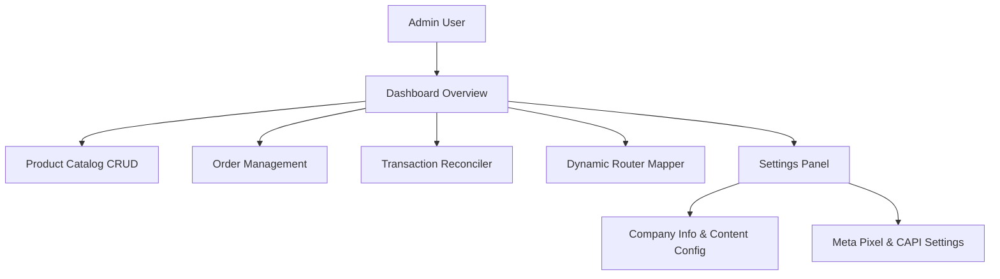
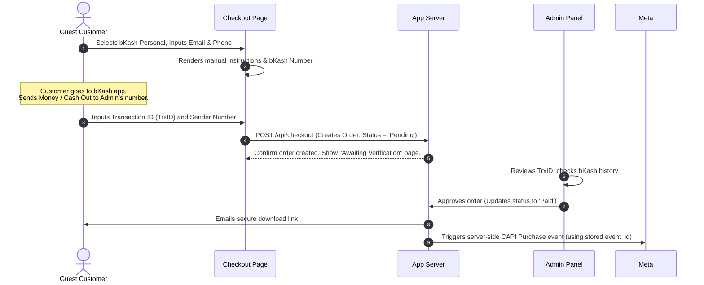

# System Architecture Specification: Lumina Digital

**Project Title**: Digital Product E-Commerce Platform
**Target Audience**: Digital product sellers (courses, PDFs, videos, zip files)
**Core Selling Model**: 100% Guest Purchase (no mandatory account creation)
**Tracking Strategy**: High-reliability Meta Pixel + Conversions API (CAPI)

---

## 1. Executive Summary & Design System

### 1.1 Platform Goal

Lumina Digital is a high-conversion e-commerce platform designed specifically for selling intellectual property and digital downloadable products (such as online video courses, PDF guides, software zip archives, and single video files). By eliminating user registration barriers, every customer completes their purchase via a frictionless **Guest Checkout Flow**.

### 1.2 Visual Identity & Styling

The user interface follows the **Lumina Digital** design system (defined in detail within [design.md](file:///home/xspoilt/Documents/digicom/docs/design.md)):

* **Branding & Vibe**: "Lite & Premium", modern minimalism, expansive white space, and clear typography hierarchy.
* **Color Palette**:
  * `Primary (Digital Blue)`: `#0058be` for major calls-to-action, navigation, and conversion points.
  * `Secondary (Violet)`: `#6b38d4` for course levels, premium badges, and indicators.
  * `Tertiary (Teal)`: `#00685d` for successful checkout, badge tags, and positive statuses.
  * `Surfaces`: Off-white `#faf8ff` background with crisp white `#ffffff` cards and containers.
* **Typography**: Google Font **Inter** exclusively, utilizing robust letter-spacing adjustments for large headers to establish editorial premium weight.
* **Elevation & Shapes**: Soft 12px rounding for input fields and buttons, 16px rounding for product thumbnails. Ambient, blurred drop shadows for an elegant, elevated layout.

---

## 2. Core Functional Requirements & Site Features

### 2.1 E-Commerce Landing Page

* **Interactive Showcase**: A clean, single-page or multi-page product landing system.
* **Dynamic Sections**: Hero header, features/benefits grid, course curriculum modules, trust badges, customer reviews/testimonials, and a direct conversion footer.
* **No Placeholders**: High-quality product thumbnails, crisp icons, and live metadata (file size, duration, format).

### 2.2 Guest-Only Purchase Flow

**Checkout Form can be customized by admin panel when admin creates the products if name and email it will ask name and email,** 

**if it Name number then that is ....if name** 

**Email sending or displaying the file in the Website that is also controlled by admin panel yes no based system** 

* **Checkout Form**: Simple two-step modal or embedded form collecting only essential customer details:
  * *Customer Email* (for delivery and receipts)
  * *Customer Phone Number* (for verification and SMS notifications)
* **Frictionless Transaction**: No passwords or registration hoops. Once a transaction is successfully completed, the user is redirected to a temporary secure **Download & Access Portal** generated uniquely for their Order ID.
* **Delivery Mechanism**:
  * An automated email sent immediately upon payment clearance containing the unique download link.
  * *Expiration Limits*: Secure links that expire after a set time (e.g., 48 hours) or maximum download limit (e.g., 5 downloads) to prevent sharing abuse.

### 2.3 Supported Product Types

The platform natively handles multiple product delivery models:

1. **PDF/Ebook**: Instant downloadable file served securely from a private storage bucket (S3, Cloudflare R2, or local private volume).
2. **Zip File (Software/Assets)**: Secure compressed archive download.
3. **Video Files**: Single video download or embedded, secure streamable video player.
4. **Online Courses**: A structured page displaying curriculum chapters, progress tracker (matching the 8px rounded track design), and HTML5 video content streaming.

---

## 3. Professional Admin Panel Specs

The Admin Panel is a premium, secure dashboard for managers to oversee storefront operations.

### 3.1 Dashboard Page (Overview)

* **Key Performance Indicators (KPIs)**: Total Sales Revenue, Completed Orders vs. Pending Orders, Conversion Rates (InitiateCheckout -> Purchase), and Average Order Value (AOV).
* **Analytics Charts**: Weekly/Monthly earnings line chart, Top Selling Products breakdown, and Traffic referral logs.
* **Real-time Activity Stream**: Visual feed of recent checkouts, payment requests, and download hits.

### 3.2 Orders Page

* **Status Management**: Filter orders by status (`Pending`, `Processing`, `Paid`, `Failed`, `Cancelled`).
* **Order Details View**: Customer details (email, phone), order timestamp, items purchased, browser headers (User Agent, IP), and Meta Pixel tracking payload (`event_id`, `fbc`, `fbp`).
* **Manual Verification**: Ability for admin to review manual payments and toggle status from `Pending` to `Paid` manually.

### 3.3 Transactions Page

* **Transaction Register**: Comprehensive financial ledger.
* **Details Captured**: Payment Gateway name, unique Transaction ID (TrxID) provided by the user, sender's wallet phone number, exact amount paid, and association back to the corresponding Order ID.
* **Reconciliation Tool**: Match manual transactions against raw incoming SMS logs or payment gateway events.

### 3.4 Products Page

* **Create / Update Product Form**:
  * `Title`, `Slug`, `Description`, `Price` (BDT/USD), `Compare-at Price`.
  * `Product Type` dropdown (Course, PDF, Video, Zip, Other).
  * `File Uploader` (drag-and-drop secure media files) or `Delivery Link` text field.
  * `Thumbnail Image` upload.
  * `Meta Data`: Duration (for courses/videos), page count (for PDFs), version number (for zips).

### 3.5 Settings Page

* **Meta Pixel & CAPI Tokens**: Input fields for `Meta Pixel ID`, `Conversions API Token`, and `Test Event Code` to allow hot-swapping tracking IDs without redeploying code.
* **Company Information**: Editing site details (Company Name, Address, Support Email, Support Telegram channel link, copyright notice).
* **Dynamic Route Creator (Route Redirect Engine)**:
  * *Requirement*: Let admins create custom routes pointing to default system routes.
  * *Example*: A product is created at `/products/mastering-laravel-pdf`. Admin wants to advertise it as `/laravel-guide` or `/book`.
  * *UI*: A simple key-value table:
    * `Source Path`: `/laravel-guide`
    * `Destination Path`: `/products/mastering-laravel-pdf`
    * `Redirect Type`: `Rewrite (internal render)` or `Redirect 301 / 302`.
  * *Implementation*: A dynamic middleware intercepts incoming requests, checks the route database, and handles the rewrite/redirect accordingly.

---

## 4. Payment Gateway Implementations

The architecture supports a two-tier payment processing layer to handle immediate manual bKash processing and future Automated Gateways.

### 4.1 Tier 1: bKash Personal (Manual Verification)

Since bKash Personal accounts do not provide official payment checkout APIs, the platform uses a structured checkout validation UX:

### 4.2 Tier 2: EPS Payment Gateway (Automated Integration)

The system is built with a decoupled payment adapter pattern to quickly swap to **EPS Payment Gateway** once merchant credentials are API-ready.

* **Payment Flow**: On checkout click, redirect client to the EPS host page with standard payload.
* **Automatic Webhook**: EPS sends a server-to-server callback POST request upon payment success, immediately updating the Order to `Paid` and triggering automatic digital delivery + CAPI Purchase without admin intervention.

---

## 5. Meta Pixel & Conversions API (CAPI) Integration

We implement a hardened tracking architecture following the rules defined in [SKILL.md](file:///home/xspoilt/Documents/digicom/docs/SKILL.md).

### 5.1 Event Tracking Mapping

| Event Name                 | Trigger Point                    | Client Payload                                                        | CAPI (Server-Side) Payload                                                                            |
| :------------------------- | :------------------------------- | :-------------------------------------------------------------------- | :---------------------------------------------------------------------------------------------------- |
| **PageView**         | On page load / route change      | URL, browser cookies (`_fbp`/`_fbc`)                              | N/A (Client-only standard)                                                                            |
| **ViewContent**      | Visiting a specific product page | `content_ids`, `content_type: 'product'`, `value`, `currency` | Triggered server-side when loading product query to bypass ad-blockers, sharing the same`event_id`. |
| **InitiateCheckout** | Opening/submitting checkout form | `content_ids`, `value`, `currency`                              | Fired when server receives checkout creation request.                                                 |
| **Purchase**         | Payment validation completion    | Fired only on success/receipt page if validated.                      | **Source of truth.** Fired via server hook upon Order status turning to `Paid`.               |

### 5.2 Deduplication Strategy

To ensure Meta does not count duplicate events from clients and servers:

* A unique, random `event_id` (UUIDv4) is generated at the start of the action (e.g., when the product page loads or checkout starts).
* This single `event_id` is passed as a parameter in both the client-side `fbq('track', eventName, params, { eventID })` call and the server-side API call.
* Meta's servers automatically deduplicate the events when they observe the matched transaction ID / event ID combination.

---

## 6. Technical Stack Recommendations

To achieve the best speed, SEO, security, and developer efficiency, we propose the following production stack:

* **Frontend & Routing**: **Next.js (App Router)**. Allows React Server Components (RSC) for lightning-fast product pages, static metadata parsing for premium SEO, and robust API endpoints for checkout hooks.
* **Backend : HonoJs Server.**
* **Styling**: **Vanilla CSS** or Tailwind CSS as desired. Built using the Lumina Digital UI framework with responsive layouts (12-column grid desktop, fluid single-column mobile).
* **Database**:  **MongoDB** To handle relations between Products, Orders, Transactions, Redirect Routes, and System Config values.
* **File Storage**: Server Storage
* **Admin Panel Framework**: Built directly into Next.js dashboard

---

### Links & Reference Docs

* Design System details: [design.md](file:///home/xspoilt/Documents/digicom/docs/design.md)
* Meta Pixel & CAPI Standards: [SKILL.md](file:///home/xspoilt/Documents/digicom/docs/SKILL.md)
* CAPI Implementation references:
  * [nextjs-integration.md](file:///home/xspoilt/Documents/digicom/docs/references/nextjs-integration.md)
  * [capi-server-setup.md](file:///home/xspoilt/Documents/digicom/docs/references/capi-server-setup.md)
  * [standard-events.md](file:///home/xspoilt/Documents/digicom/docs/references/standard-events.md)
  * [troubleshooting.md](file:///home/xspoilt/Documents/digicom/docs/references/troubleshooting.md)
