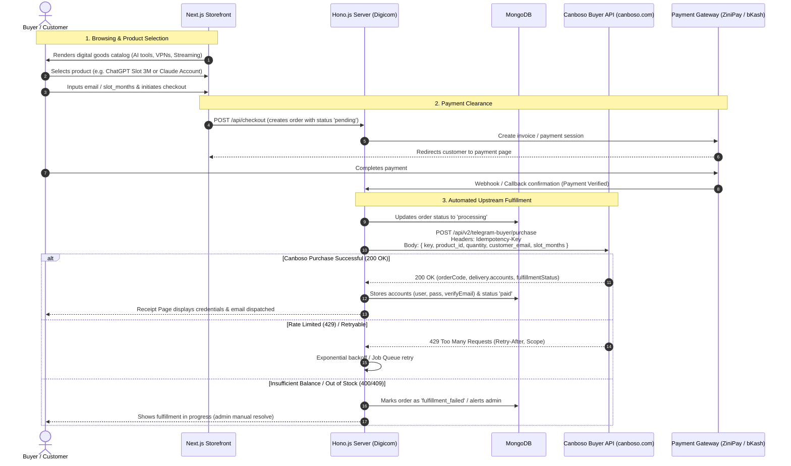
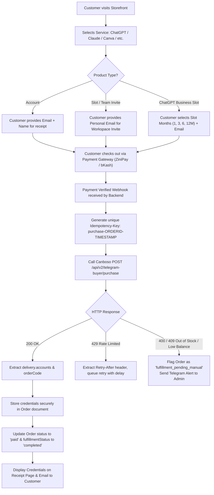

# Canboso Telegram Buyer API Integration Specification (v2.1.0 OAS 3.0)

**Document Version**: 1.0.0  
**Target Upstream API**: Canboso Telegram Buyer API v2.1.0 (OAS 3.0)  
**Host**: `https://canboso.com`  
**System Role**: Automated Digital Account & Subscription Purchasing, Inventory Synchronization, and Instant Fulfillment Engine  

---

## 1. Executive Summary & Architecture

The Kalobazar / Digicom platform is transitioning from traditional static downloads (PDFs, video courses) to an **automated digital subscription and account marketplace**. Products sold include AI subscriptions (ChatGPT Plus, ChatGPT Business Slots, Claude Pro, Cursor, Midjourney), creative suites (Adobe CC, Canva Pro, CapCut), streaming platforms (Netflix, Spotify, YouTube), VPN services (NordVPN, ExpressVPN), and developer tools (Lovable, Railway, n8n).

Fulfillment of these digital goods is automated through the **Canboso Telegram Buyer API v2.1.0**. When a customer completes checkout on our store, our backend calls Canboso's `/purchase` endpoint with an `Idempotency-Key` and the buyer API key. Canboso instantly provisions credentials (user, password, recovery email) or dispatches team workspace invitations directly to the customer's email.



---

## 2. Canboso Buyer API Specification (OAS 3.0)

### 2.1 Base Configuration
* **Base URL**: `https://canboso.com`
* **Protocol**: HTTPS / TLS 1.3
* **Authentication**: Query parameter `key` (unique buyer API key, e.g. `tgb_1234567890abcdef...`)
* **Bot Sources Supported**: Telegram, Telegram 2nd, Binance bot, Bybit bot. The API key automatically encodes the bot flow; no extra bot identifier is required.
* **Response Language**: Inherited from the buyer API key configuration (default `en` or `vi`).
* **Wallet Currency**: Primarily `VND` (Vietnamese Dong) or unified `USD`.

### 2.2 Rate Limiting & Escalating Abuse Penalties

The Canboso API enforces strict sliding-window quotas with escalating penalties.

#### Quota Window: 60 Seconds
| Scope | Quota Limit |
| :--- | :--- |
| **API key across all endpoints** | 60 requests / min |
| **Source IP across all endpoints** | 120 requests / min |
| **Buyer key: products** | 30 requests / min |
| **Seller aggregate: products** | 100 requests / min |
| **Buyer key: balance** | 30 requests / min |
| **Seller aggregate: balance** | 300 requests / min |
| **Buyer key: purchase** | 60 requests / min |
| **Seller aggregate: purchase** | 50 requests / min |
| **Invalid auth attempts per key** | 5 requests / min |
| **Invalid auth attempts per IP** | 15 requests / min |

#### Escalating Abuse Penalty Levels
When any key, IP, or seller aggregate exceeds a quota, Canboso places the caller into a temporary escalating block:
* **Level 0**: Edge Nginx burst limiter (< 1 second).
* **Level 1**: 1-minute block.
* **Level 2**: 5-minute block.
* **Level 3**: 15-minute block.
* **Level 4**: 1-hour block.
* **Level 5**: 6-hour block (all subsequent violations remain at Level 5).

> [!CAUTION]
> **Strike Level Persistence**: The strike level resets only after 24 hours without another violation. Clients must **NEVER** retry in a tight loop and must strictly honor the `Retry-After` header.

#### 429 Error Response Structure:
```json
{
  "success": false,
  "code": "RATE_LIMITED",
  "message": "Too many requests. Please try again later.",
  "errors": [],
  "requestId": "d9cad039-fe44-4dea-af8d-94313ad86ae9",
  "retryable": true,
  "rateLimit": {
    "scope": "products_buyer",
    "penaltyLevel": 2,
    "retryAfter": 300
  }
}
```

Response Headers returned on 429:
* `Retry-After`: Integer seconds to wait before attempting any new request.
* `X-RateLimit-Limit`: Maximum requests permitted in the bucket.
* `X-RateLimit-Remaining`: Requests remaining.
* `X-RateLimit-Reset`: Unix epoch timestamp (seconds) when bucket resets.
* `X-RateLimit-Scope`: Rejecting bucket (e.g. `products_buyer`, `global_key`, `auth_key`).
* `X-RateLimit-Penalty-Level`: Active penalty tier (0 to 5).

---

## 3. API Endpoints & Request/Response Models

### 3.1 List Products (`GET /api/v2/telegram-buyer/products`)

Fetches all active products available for the buyer key.

* **Method**: `GET`
* **Path**: `/api/v2/telegram-buyer/products?key={buyer_key}`
* **Rate Limit**: 30 requests / 60 seconds

#### Response Schema (200 OK):
```json
{
  "success": true,
  "lang": "en",
  "walletCurrency": "VND",
  "products": [
    {
      "productId": "64f0c0f2b90c2b4c5a123456",
      "name": "ChatGPT Plus",
      "description": "Product description",
      "image": "/uploads/product.png",
      "emoji": "chatgpt",
      "productType": "account",
      "price": {
        "amount": 50000,
        "currency": "VND",
        "text": "50.000 ₫"
      },
      "availability": {
        "available": 60,
        "sold": 40
      },
      "promotions": [
        {
          "type": "bulk_discount",
          "minQty": 3,
          "percent": 10,
          "bonusQty": 1
        }
      ],
      "purchaseRequirements": {
        "customerEmail": true,
        "slotMonths": true,
        "quantityFixed": 1,
        "allowedMonths": [1, 3, 6, 12]
      }
    }
  ]
}
```

#### Product Types:
1. **`account`**: Pre-activated private account. Delivery yields login credentials (`user`, `password`, `verifyEmail`).
2. **`slot`**: Team or enterprise workspace seat. Requires `customerEmail`.
3. **`slot_chatgpt_business`**: Dedicated ChatGPT Team/Business slot product. Requires `customerEmail` and `slotMonths` matching `purchaseRequirements.allowedMonths`.

---

### 3.2 Check Buyer Wallet Balance (`GET /api/v2/telegram-buyer/balance`)

Checks available spendable funds in the upstream buyer wallet.

* **Method**: `GET`
* **Path**: `/api/v2/telegram-buyer/balance?key={buyer_key}`
* **Rate Limit**: 30 requests / 60 seconds

#### Response Schema (200 OK):
```json
{
  "success": true,
  "lang": "en",
  "botSource": "primary",
  "walletCurrency": "VND",
  "requester": {
    "chatId": 1336962312,
    "name": "buyer_demo"
  },
  "balance": 250000,
  "balanceVnd": 250000,
  "balanceUsd": 9.25,
  "balanceText": "250.000 ₫",
  "usdtBalance": 0,
  "updatedAt": "2026-03-25T09:15:00.000Z"
}
```

---

### 3.3 Purchase & Instant Delivery (`POST /api/v2/telegram-buyer/purchase`)

Executes automated order placement and immediate inventory extraction.

* **Method**: `POST`
* **Path**: `/api/v2/telegram-buyer/purchase`
* **Header**: `Idempotency-Key: purchase-{timestamp}-{uuid}` (Mandatory)
* **Rate Limit**: 60 requests / 60 seconds

#### Request Body:
```json
{
  "key": "tgb_1234567890abcdef1234567890abcdef1234567890abcdef",
  "product_id": "64f0c0f2b90c2b4c5a123456",
  "quantity": 1,
  "customer_email": "buyer@example.com",
  "slot_months": 3
}
```

#### Input Validation Rules:
* `quantity`: Default 1. For slots (`productType = slot` or `slot_chatgpt_business`), must be fixed to 1.
* `customer_email`: Required when `product_id === "slot_chatgpt_business"` or `productType === "slot"`.
* `slot_months`: Required **only** when `product_id === "slot_chatgpt_business"`. Must be one of `purchaseRequirements.allowedMonths` (e.g. `1`, `3`, `6`, `12`). Do not send for regular catalog slot products.

#### Response Schema (200 OK):
```json
{
  "success": true,
  "lang": "en",
  "order": {
    "orderCode": "ORDER1A2B3C4D5E",
    "status": "completed",
    "productId": "64f0c0f2b90c2b4c5a123456",
    "productName": "ChatGPT Plus",
    "productType": "account",
    "quantity": 2,
    "bonusQuantity": 1,
    "finalQuantity": 3,
    "slotMonths": 3,
    "customerEmail": "buyer@example.com",
    "fulfillmentStatus": "completed",
    "autoCompleted": true
  },
  "payment": {
    "amount": 90000,
    "amountText": "VND 90,000",
    "originalAmount": 100000,
    "originalAmountText": "VND 100,000",
    "discountPercent": 10,
    "discountAmount": 10000,
    "discountAmountText": "VND 10,000",
    "currency": "VND",
    "balance": 120000,
    "balanceText": "VND 120,000"
  },
  "delivery": {
    "accounts": [
      {
        "user": "account1@example.com",
        "password": "secret-password-123",
        "verifyEmail": "recovery@example.com",
        "expiryText": "30 Days Active",
        "otherInfo": "Do not change 2FA settings"
      }
    ]
  }
}
```

---

## 4. Purchasing & Fulfillment Workflow in Digicom



---

## 5. Architectural Components & Implementation Design

### 5.1 Currency Conversion & Profit Margin Pricing Engine
Canboso prices in **VND** (or USD). Our local storefront operates in **BDT** (Bangladeshi Taka) and **USD**.

$$\text{Store Price (BDT)} = \left( \frac{\text{Canboso Amount in VND}}{\text{VND per BDT Exchange Rate}} \right) \times (1 + \text{Profit Margin \%}) + \text{Fixed Markup}$$

* **Example**:
  - Upstream Canboso price: 50,000 VND
  - VND to BDT rate: ~200 VND = 1 BDT (i.e. 50,000 VND = 250 BDT)
  - Profit margin: 30% (75 BDT)
  - Retail Selling Price: 325 BDT (or round to nearest 10: 330 BDT)

### 5.2 Rate Limit Protector & Token Bucket
To ensure we never trigger Canboso abuse penalties:
1. **In-Memory Rate Limiter**:
   - Outgoing requests to Canboso are gated by an internal token bucket (max 25 requests/min for products, 50 requests/min for purchases).
2. **Circuit Breaker**:
   - If a 429 response is received, the circuit breaker opens for `Retry-After` seconds. All non-urgent calls (e.g. background catalog refresh) are suspended.
3. **Idempotency Guard**:
   - Every purchase generates a persistent `Idempotency-Key` stored in the MongoDB `Order` document. If network times out, retrying with the exact same `Idempotency-Key` guarantees Canboso returns the original fulfilled order without charging the buyer balance twice.

### 5.3 Upstream Inventory Caching Strategy
* Querying `/products` directly on every customer page load would breach the 30 req/min limit.
* **Solution**:
  - Cached catalog in memory / Redis with a **3-minute TTL**.
  - Background worker refreshes the catalog every 3 minutes.
  - On product checkout, an instantaneous stock check against the cached availability ensures high throughput.

### 5.4 Buyer Balance Health Check & Low-Balance Safeguard
* A cron job polls `/api/v2/telegram-buyer/balance` every 15 minutes (well within the 30 req/min limit).
* If spendable balance falls below threshold (e.g. < 300,000 VND / ~1,500 BDT):
  - Sends immediate Telegram alert to Admin.
  - Switches out-of-stock products automatically to prevent customer payment without immediate fulfillment.

---

## 6. Database Schema Specifications (Backend Blueprint)

### 6.1 `Product` Model Extensions (`server/src/models/Product.ts`)
```typescript
export interface IProduct extends Document {
  title: string;
  slug: string;
  description: string;
  price: number;
  compareAtPrice?: number;
  
  // Digital Goods & Buyer API Classification
  type: "account" | "slot" | "license" | "course" | "pdf" | "video" | "zip" | "other";
  serviceTag: string; // e.g. "chatgpt", "claude", "canva", "cursor", "nordvpn"
  
  // Upstream Canboso Integration
  autoFulfill: boolean;
  upstreamProductId?: string; // Canboso productId or "slot_chatgpt_business"
  purchaseRequirements?: {
    customerEmail: boolean;
    slotMonths: boolean;
    quantityFixed?: number;
    allowedMonths?: number[]; // [1, 3, 6, 12]
  };
  availability?: {
    available: number;
    sold: number;
  };
  promotions?: Array<{
    type: string;
    minQty: number;
    percent: number;
    bonusQty?: number;
  }>;
  
  // Traditional media properties (for backward compatibility)
  filePath?: string;
  deliveryLink?: string;
  thumbnailPath?: string;
  checkoutFields: string[];
  active: boolean;
}
```

### 6.2 `Order` Model Extensions (`server/src/models/Order.ts`)
```typescript
export interface IDeliveryAccount {
  user: string;
  password?: string;
  verifyEmail?: string;
  expiryText?: string;
  otherInfo?: string;
}

export interface IOrder extends Document {
  orderId: string;
  customerEmail?: string;
  customerName?: string;
  customerPhone?: string;
  
  // Canboso Purchase Input Details
  slotMonths?: number;
  quantity: number;
  
  // Fulfillment Details
  fulfillmentStatus: "unfulfilled" | "waiting_seller" | "completed" | "failed";
  autoCompleted: boolean;
  upstreamOrderCode?: string; // e.g. "ORDER1A2B3C4D5E"
  idempotencyKey?: string;
  deliveryAccounts?: IDeliveryAccount[];
  
  // Standard Financials & Tracking
  total: number;
  status: "pending" | "processing" | "paid" | "failed" | "cancelled";
  paymentGateway: string;
  metaEventId: string;
}
```

---

## 7. Storefront UX Requirements (Ready for Sales)

To support this product model immediately, the storefront requires:
1. **Interactive Brand Pill Filters**:
   - Direct filter buttons matching user screenshot (ChatGPT, Gemini, Claude, Adobe, CapCut, Grok, Lovable, Canva, Runway, Kling, Cursor, AutoDesk, Spotify, Netflix, NordVPN, etc.).
2. **Subscription & Account Badges**:
   - "⚡ Instant Account Delivery" vs "📧 Slot / Team Invite".
   - Duration pills: 1M, 3M, 6M, 12M.
3. **Dynamic Checkout Modal**:
   - Conditional email field specifically explaining team invite delivery when `productType === 'slot'` or `slot_chatgpt_business`.
   - Duration selector (`slot_months`) when applicable.
4. **Credential Display on Receipt Page**:
   - Username/Email with copy button.
   - Password with reveal/hide toggle and copy button.
   - Verification/Recovery email and validity expiration text.
   - One-click "Copy All Details" button.

---

## 8. Backend Implementation Roadmap (To Be Applied After Docs)

* **Phase 1 (Completed)**: Architecture, Purchasing Flow & OpenAPI 3.0 Documentation.
* **Phase 2 (Completed in this step)**: Storefront UI redesign, brand filter ribbon, dynamic subscription checkout modal, and account credentials receipt viewer.
* **Phase 3**: Build `server/src/services/canbosoClient.ts` with sliding-window rate limiter, token bucket, and `Retry-After` circuit breaker.
* **Phase 4**: Implement `/api/admin/canboso/sync` catalog importer with currency markup rules.
* **Phase 5**: Hook `fulfillPaidOrder()` to dispatch purchase to Canboso with `Idempotency-Key` and store returned credentials in MongoDB.
